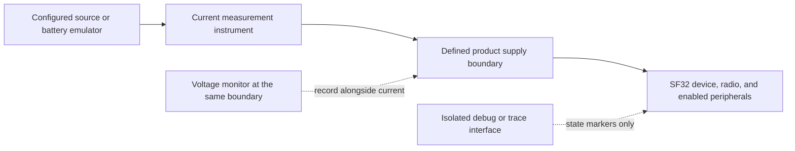
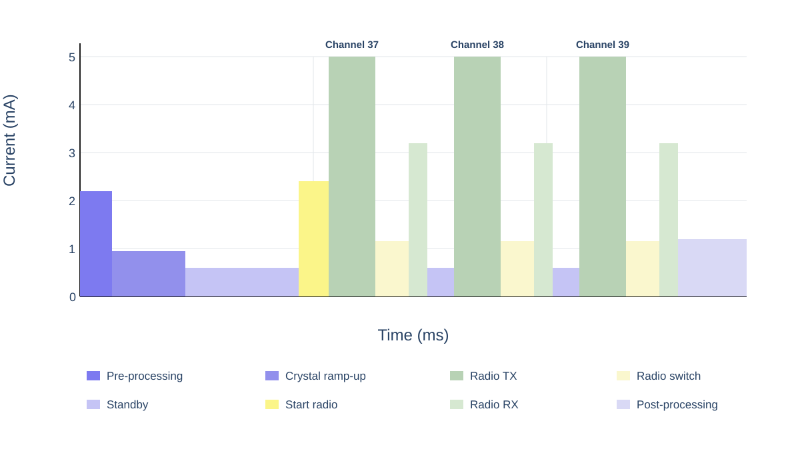
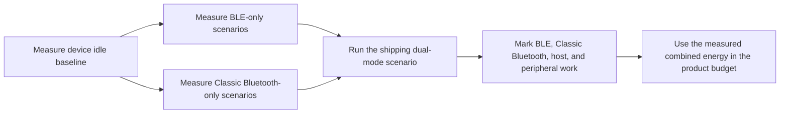

# Bluetooth Low-Power Profiling { #bluetooth-low-power-profiling }

This article explains how to determine the **actual Bluetooth power consumption of a device**: Bluetooth Low Energy (BLE), Classic Bluetooth (BR/EDR), and their real combined behavior on a dual-mode product. The goal is a repeatable product measurement: current and voltage at a defined electrical boundary, under a defined Bluetooth scenario, with enough firmware evidence to explain every important part of the trace.

Apply the Classic Bluetooth and dual-mode parts of this article only to a device and firmware configuration that support BR/EDR. A BLE-only product should still use the same method, but its scenario plan stops at BLE.

Nordic's [Online Power Profiler for Bluetooth LE](https://devzone.nordicsemi.com/power/w/opp/2/online-power-profiler-for-bluetooth-le) is a useful conceptual reference for BLE. Nordic describes it as a model derived from measurements that produces expected values, not a measurement of a specific device. Its published accuracy experience applies to Nordic reference parts only and must not be applied to SF32. It does not model Classic Bluetooth or a dual-mode product. Use a model to decide what to test; use a current measurement on the target device to establish the product result.

## Define What You Are Measuring

"Bluetooth power" can mean very different things. A radio-only measurement can help optimize a connection parameter, but it does not reveal the power a shipping device draws when the controller, application CPU, sensors, display, memory, and power supply are all involved.

<div align="center"><em>Table: Bluetooth Power Measurement Boundaries</em></div>

<div align="center" markdown>

| Boundary | What it includes | When to use it | Limitation |
|:---------|:-----------------|:---------------|:-----------|
| Bluetooth subsystem or selected rail | Radio/controller and the selected supply path | Isolating a radio or controller regression | Does not equal whole-device battery consumption |
| MCU input rail | MCU, controller, and on-chip peripherals supplied by that rail | Comparing firmware states on a controlled board | Excludes external components on other rails and regulator loss |
| Battery or main product input | Regulators, MCU, external memory, sensors, display, and other powered loads | Battery-life modeling and product acceptance | Requires careful control of all attached hardware and supplies |

</div>

For a product battery-life claim, measure at the battery or main product-input boundary whenever practical. Record the voltage with current, so the result can be expressed as power and energy rather than a current number detached from its supply condition.

## Set Up a Repeatable Test

The instrument and the device must share a clearly documented test boundary. Nordic's Power Profiler Kit II (PPK II) is a useful reference-class source measure tool when its voltage and current ranges suit the setup. An equivalent source measure unit or current analyzer is also valid. The discipline matters more than the brand of instrument.

<div align="center"><em>Figure: Device-Level Bluetooth Power Measurement Setup</em></div>



Before each run:

1. Disconnect USB power, a debugger, or other supplies that can bypass the instrument or add load. Keep only the interfaces required by the scenario.
2. Apply the documented supply voltage at the selected boundary. Record every powered rail, jumper, module, and external device.
3. Use the product firmware build and its intended PM configuration. Disable high-volume diagnostic logging for final numbers unless it is part of the shipping configuration.
4. Prepare the same phone, accessory, test application, distance, antenna orientation, and RF environment for each comparison.
5. Capture a sufficiently long window to include many repeated Bluetooth events, not only one convenient pulse.

## Read a BLE Advertising Event as a Set of Power Components

A typical BLE advertising event is not one radio pulse. It starts with a short power-up and preparation phase, ramps up the high-frequency crystal, and then enters standby until the scheduled radio start time. The device starts the radio, transmits on the primary advertising channels, and returns to standby between the receive window on one channel and the transmit attempt on the next. It then processes the result before returning to its lowest permitted state. For scannable or connectable advertising, it can open a receive window after each advertising packet.

The diagram below redraws the stage types and stage order in Nordic's advertising illustration: Pre-processing, Crystal ramp-up, Standby, Start radio, Radio TX, Radio switch, Radio RX, and Post-processing. It deliberately adds no other state. The visual proportions are illustrative; measure current and timing on the SF32 target device.

<div align="center"><em>Figure: BLE Advertising-Event Stages</em></div>



<div align="center"><em>Table: Stages in a BLE Advertising-Event Power Trace</em></div>

<div align="center" markdown>

| Stage | Typical active contributors | What to measure and verify |
|:------|:----------------------------|:---------------|
| Pre-processing | A short power-up phase, CPU/controller preparation, payload handling, DMA, memory access, and peripheral setup | `I_pre` and `t_pre`; identify the required wake and power-up work, then remove or batch any avoidable work |
| Crystal ramp-up | High-frequency clock startup and stabilization | `I_xtal` and `t_xtal`; confirm that the clock policy and wake sequence are no longer than required |
| Standby | The selected low-power state after power and clocks are ready, plus retention logic, low-frequency timing, and enabled wake sources | `I_standby` and the initial wait before radio start, plus the inter-channel standby periods after RX; a long advertising interval can make this stage dominate the average |
| Start radio | Radio/controller preparation and the required RF supply path before the advertising event | `I_start` and `t_start`; identify unnecessary preparation or repeated startup work |
| Radio TX | Radio transmit path, controller work, and advertising-packet transmission on channels 37, 38, and 39 | `I_tx` and `t_tx` for every packet; TX power, packet length, retries, and enabled channels directly affect this energy |
| Radio switch | The radio's transmit-to-receive turnaround and controller state transition | `I_switch` and `t_switch`; count every transition rather than treating it as free time |
| Radio RX, if enabled | Receive path and controller work while waiting for a scan request or connection request | `I_rx` and `t_rx`; include only when the advertising type and configuration open receive windows |
| Post-processing | Protocol callbacks, CPU work, memory/peripheral access, and any application response before sleep | `I_post` and `t_post`; verify that clocks, PM constraints, and external components are released promptly |

</div>

The Nordic example labels each measured stage explicitly. On an SF32 device, use the same labels as trace-marking prompts, not as assumed timing or current values. Whether a target advertising configuration includes receive activity depends on its configured advertising behavior and must be verified from the target trace.

For a complete event, energy is the voltage-weighted area under the trace:

```text
E_event = sum(V_stage x I_stage x t_stage)
```

At a constant supply voltage, a periodic advertising configuration can be approximated as:

```text
I_average = (I_standby x (T_advertising - sum(t_active,k)) + sum(I_active,k x t_active,k)) / T_advertising
```

Every stage affects the result linearly: doubling either a stage's measured current or its duration doubles that stage's energy. Short TX, RX, and startup bursts can dominate event energy because their current is high; a long advertising interval can instead make the standby portion dominate average current. Tag the stages with GPIO markers or low-overhead firmware events, then measure the whole product boundary before choosing an optimization target.

Classic Bluetooth has different protocol timing, but the same measurement discipline applies: identify every preparation, radio-active, transition, and post-processing interval and include each area in the energy budget.

## Build a Mode-Specific Measurement Plan

Do not treat "Bluetooth enabled" as one operating state. BLE and Classic Bluetooth use different connection and low-power procedures, while a dual-mode product shares one radio subsystem, controller resources, clocks, memory, and often application work between them. Start with the smallest repeatable scenarios, then measure the exact combined behavior the product ships.

<div align="center"><em>Table: Bluetooth Scenario Coverage</em></div>

<div align="center" markdown>

| Radio capability | Scenario | What to define before measuring | Result to retain |
|:-----------------|:---------|:--------------------------------|:-----------------|
| BLE | Advertising, connected idle, application transfer, and reconnect | Role, interval, TX power, payload, peer, start/end conditions | Average current, event energy, and energy per completed action |
| Classic Bluetooth (BR/EDR) | Scan state | Whether inquiry scan, page scan, or both are enabled; discoverability/connectability policy | Average current and energy over a representative scan window |
| Classic Bluetooth (BR/EDR) | Connected Sniff mode | Sniff parameters, peer, link state, and background application activity | Average current and energy over many Sniff intervals |
| Classic Bluetooth (BR/EDR) | Active profile workload | Profile and role, for example SPP/PAN data or A2DP/HFP audio; payload or audio session duration | Energy per completed transfer or session, plus sustained average power |
| Dual mode | BLE and Classic Bluetooth used together | Which links coexist, their parameters, foreground workload, and transition/reconnect behavior | Measured combined average power and energy per complete product scenario |

</div>

SiFli's [BLE/BT Power Consumption Test](https://docs.sifli.com/projects/sdk/latest/en/sf32lb52x/example/pm/bt/README.html) is a useful baseline because it covers BLE advertising and connection modes as well as Classic Bluetooth Scan and Sniff modes. It does not turn any one board result into a product specification. Use its supported-board, wake-pin, console, and PM setup to make the baseline repeatable, then reproduce the intended product role, peer, traffic, and power policy on the target hardware.

## Profile BLE as a Standalone Radio Mode

Start with BLE alone. This establishes the BLE baseline without Classic Bluetooth profile traffic or cross-mode scheduling obscuring the trace.

<div align="center"><em>Table: Standalone BLE Scenario Set</em></div>

<div align="center" markdown>

| Scenario | Setup | What to calculate | Typical cause of a misleading result |
|:---------|:------|:------------------|:-------------------------------------|
| Advertising | Device is discoverable but not connected | Average current and energy per advertising interval | Phone scanning behavior, debug traffic, or advertising that never backs off |
| Connected idle | Bonded device is connected with no application transfer | Average current over many connection intervals | Application CPU wakes on every connection event; timers or notifications remain active |
| User interaction | One representative GATT command, sensor upload, or UI-triggered action | Energy per completed action and added energy over idle | Only measuring the radio while ignoring host, display, or sensor work |
| Burst transfer or OTA | A defined payload with a defined completion condition | Energy per byte or per completed transfer, plus total duration | Using a peak rate as though it represented the whole transfer |
| Disconnect and reconnect | BLE peer leaves range, returns, and reconnects | Energy and time to recover | Unbounded retries or an aggressive advertising policy continuing indefinitely |

</div>

Record the BLE role, peer, connection or advertising parameters, TX power, payload, start trigger, end condition, and real-use frequency. A trace without these facts cannot be compared with another firmware revision.

## Profile Classic Bluetooth as a Standalone Radio Mode

On a dual-mode product, measure Classic Bluetooth separately before introducing BLE. This makes the Scan and Sniff baseline, plus any profile-specific system work, visible without BLE events interleaving with it.

<div align="center"><em>Table: Standalone Classic Bluetooth Scenario Set</em></div>

<div align="center" markdown>

| Scenario | Setup | What to calculate | Typical cause of a misleading result |
|:---------|:------|:------------------|:-------------------------------------|
| Scan | The shipping inquiry-scan, page-scan, or combined policy is active | Average current and energy over a representative scan window | Leaving a more aggressive scan policy enabled than the shipping product uses |
| Connected Sniff mode | A connected Classic Bluetooth link enters its intended Sniff configuration | Average current over many Sniff intervals | Measuring a link that silently remains active because of peer traffic or application work |
| Active profile workload | A defined SPP/PAN data transfer, A2DP stream, HFP call, or other shipping profile workload | Energy per completed transfer or session, plus sustained average power | Measuring the radio while omitting codec, amplifier, display, memory, or host work needed by the profile |
| Disconnect and reconnect | Classic Bluetooth peer leaves range, returns, and reconnects | Energy and time to recover | Unbounded retries or a discovery policy that remains active indefinitely |

</div>

Record the Classic Bluetooth role, peer, Scan or Sniff policy, TX power, Profile, payload or session duration, start trigger, end condition, and real-use frequency. For audio profiles, the measured boundary must include the audio path actually used by the product.

## Measure Dual-Mode Behavior as Its Own Scenario

Do not calculate product dual-mode power by simply adding a BLE measurement to a Classic Bluetooth measurement. The two modes can share radio time, controller processing, clocks, memory, and application wakeups. Their combined result can therefore differ materially from an arithmetic sum of two isolated averages.

<div align="center"><em>Figure: Dual-Mode Bluetooth Profiling Sequence</em></div>



Only after the standalone BLE and Classic Bluetooth baselines are understood should you profile a dual-mode product. For a product that keeps a BLE link available while streaming Classic Bluetooth audio, for example, measure all of the following on the same hardware and peer setup:

1. The BLE connected-idle policy on its own.
2. The Classic Bluetooth stream or data profile on its own.
3. The actual combined steady state, including the intended BLE traffic.
4. The transitions into and out of the combined state, plus error recovery and reconnect behavior.

Trace markers should identify BLE events, Classic Bluetooth profile work, application callbacks, audio or data processing, and PM-state changes. This separates radio scheduling from the system work it triggers and exposes unexpected interactions such as a BLE callback preventing the application CPU from returning to sleep during a Classic Bluetooth session.

## Correlate the Trace with Firmware Behavior

The key to finding actual device consumption is attribution. Mark or log the start and end of product work so the trace answers why current changed:

- Before and after an application-initiated transfer or notification burst.
- When the display, sensor, Flash, audio path, or other external component is enabled or disabled.
- When firmware requests a PM state and when the device actually enters it.
- When a reconnect, retry, or error-recovery path starts.

Use a GPIO trace point, low-overhead event marker, or a reproducible test script. A serial log can assist bring-up, but it can also change current consumption. Treat final measurement logging as a controlled test variable, not a free observation channel.

<div align="center"><em>Table: Reading a Bluetooth Power Trace</em></div>

<div align="center" markdown>

| Trace observation | Likely meaning | Verify in firmware or hardware |
|:------------------|:---------------|:-------------------------------|
| Short, regularly spaced pulses above a low baseline | Scheduled BLE advertising/connection events or Classic Bluetooth Scan/Sniff activity | Mode, interval or scan/Sniff policy, radio role, and actual low-power state between events |
| A larger burst immediately after each radio event | Host callback, protocol processing, or application work | Which callback runs, whether data is useful, and whether work can be batched |
| Sustained or densely repeated activity during a Classic Bluetooth session | Active Classic Bluetooth profile traffic, often accompanied by host, audio, or data processing | Profile, codec/data path, peer traffic, audio clocks, external components, and the defined session boundary |
| Interleaved BLE and Classic Bluetooth bursts | A dual-mode schedule or related host work | Which link caused each region, whether work is shared, and whether either mode delays sleep or raises retry activity |
| High current persists after the expected event | A PM constraint, peripheral, or external interface remains active | PM votes, timers, clocks, pin states, display/sensor power, and error paths |
| Sporadic long bursts | Retries, scanning, reconnects, peer traffic, or user activity | RF conditions, peer behavior, backoff/retry policy, and test script |
| Baseline changes after connecting a module or cable | The electrical boundary changed | Back-power paths, UART adapters, external pulls, module rails, and supply routing |

</div>

## Calculate Actual Energy and Daily Consumption

For a variable trace, calculate energy from current and voltage over time:

```text
E_scenario = integral(V(t) x I(t) dt)
P_average = E_scenario / T_scenario
```

If voltage is held constant at the measurement boundary, average current can also be used for comparisons. Keep the voltage record anyway, especially when moving between a regulated rail and the battery input.

For a repeated product scenario:

```text
E_day = sum(E_scenario x events_per_day) + E_mode_idle + E_other_states
```

The scenario energy must include the full device work needed to complete it. For example, a phone notification may include a connection event, host processing, a sensor or Flash access, a display update, and a return to sleep. Measuring only the RF pulse understates the device energy; measuring the entire product without trace markers makes the cause impossible to improve.

## Reconcile the Model with the Device

Use the first model to rank likely contributors, then update it from real measurements. A difference between estimate and trace is valuable: it points to a missing event, a wrong duration, an unexpected wakeup, or an external load that was not included.

<div align="center"><em>Figure: Actual Bluetooth Power-Verification Loop</em></div>


<div align="center"><em>Table: Reconciliation Questions</em></div>

<div align="center" markdown>

| Model vs. measurement mismatch | Questions to answer |
|:--------------------------------|:-------------------|
| Average current is higher than expected | Is the device entering the requested PM state? Are timers, logging, or peripheral clocks keeping it awake? |
| Event energy is higher than expected | Did the host, display, sensor, memory, or retry path do extra work? Is RF quality forcing retries or higher TX power? |
| BLE or Classic Bluetooth idle dominates battery life | Are BLE connection parameters, Classic Bluetooth Scan/Sniff policy, notification cadence, and application wakeups appropriate for the product state? |
| Dual-mode result differs from the sum of single-mode tests | Which radio periods, controller work, shared clocks, application callbacks, audio/data paths, or PM constraints overlap or prevent sleep? |
| Reconnect energy dominates | Does the product use bounded retry/backoff behavior and a realistic discovery policy? |
| Board and final product disagree | Which external rails, regulator losses, modules, antenna/enclosure effects, and interface pulls differ? |

</div>

## Start from a Repeatable SiFli Baseline

Use SiFli-SDK examples to make a Bluetooth state repeatable before measuring the product firmware. The example's supported board, supply path, jumper configuration, SDK settings, and test procedure are baseline evidence; they are not product specifications.

<div align="center"><em>Table: SiFli-SDK Bluetooth Profiling Starting Points</em></div>

<div align="center" markdown>

| Measurement target | Official starting point | Then measure on the product |
|:-------------------|:------------------------|:----------------------------|
| BLE advertising and connection power | [BLE Broadcast and Connection Power Consumption Test](https://docs.sifli.com/projects/sdk/latest/en/sf32lb52x/example/pm/ble/README.html) | Product advertising policy, connection parameters, callbacks, peer behavior, and antenna |
| Classic Bluetooth Scan and Sniff | [BLE/BT Power Consumption Test](https://docs.sifli.com/projects/sdk/latest/en/sf32lb52x/example/pm/bt/README.html) | Shipping scan policy, Sniff settings, peer behavior, and actual idle link state |
| Classic Bluetooth profile workload | [Bluetooth SDK Examples](bluetooth-sdk-examples.md) | Real SPP/PAN transfer or A2DP/HFP session, including the required host, audio, memory, and external-component work |
| Dual-mode product behavior | [BLE/BT Power Consumption Test](https://docs.sifli.com/projects/sdk/latest/en/sf32lb52x/example/pm/bt/README.html) plus the closest product profile example | The exact concurrent or alternating BLE and Classic Bluetooth behavior, including transitions, shared processing, and the product PM policy |
| Connected GATT service | [BLE Peripheral](https://docs.sifli.com/projects/sdk/latest/sf32lb58x/example/ble/peripheral/README.html) | Real characteristics, notification cadence, security, and phone interaction |
| BLE data transfer | [BLE Throughput](https://docs.sifli.com/projects/sdk/latest/sf32lb58x/example/ble/throughput/README.html) | Energy per completed payload and end-to-end completion time |
| Other Bluetooth workflows | [Bluetooth SDK Examples](bluetooth-sdk-examples.md) | The closest Classic Bluetooth, BLE, or LE Audio role/profile before product integration |

</div>

## Release Review Checklist

- [ ] The measurement boundary and supply voltage are documented.
- [ ] Current and voltage were recorded for every release-relevant scenario.
- [ ] USB, debugger, UART adapters, and external module supplies were controlled or explicitly included.
- [ ] Traces are correlated to firmware events, PM state requests, and actual entered states.
- [ ] BLE advertising/connected-idle and Classic Bluetooth Scan/Sniff behavior have been measured where applicable.
- [ ] Each shipping Classic Bluetooth data or audio profile has a defined, measured workload.
- [ ] Dual-mode scenarios have been measured as combined product states rather than estimated by adding single-mode results.
- [ ] Representative transfer, disconnect, and reconnect behavior has been measured where applicable.
- [ ] Scenario energy has been scaled with realistic daily frequency and reconciled with the battery budget.
- [ ] The largest energy contributor has an owner and an optimization or acceptance decision.

## Related Resources

- [Bluetooth Overview](overview.md) for BLE, Classic Bluetooth, profiles, security, and system coexistence.
- [Bluetooth SDK Examples](bluetooth-sdk-examples.md) for Classic Bluetooth, BLE, and LE Audio project selection.
- [Low-Power Overview](../low-power/overview.md) for PM design and the full product power budget.
- [Power Measurement and Validation](../low-power/measurement-and-validation.md) for the component-to-product validation workflow.
- [Smartwatch Power Profiling](../low-power/smartwatch-power-profiling.md) for a worked daily-use energy model.
